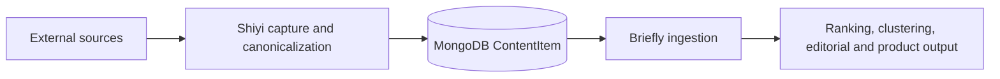

# Briefly Integration Contract

- Status: Accepted for the Briefly-first MVP
- Contract version: `content-item.v1`
- Last updated: 2026-07-19

## Purpose

This document is the handoff contract between Shiyi and Briefly. Briefly should depend on the canonical `ContentItem` document stored in MongoDB, not on Shiyi adapters, transient capture models, local files, or runner state.



Shiyi owns acquisition, provenance, canonicalization, neutral optional preprocessing, identity, deduplication, and durable storage. Briefly owns product-specific interpretation, ranking, clustering, presentation, and editorial decisions.

## Consumer boundary

Briefly may read:

- ready `ContentItem` documents from MongoDB;
- fields explicitly documented below;
- `schema_version` to select the supported contract.

Briefly must not depend on:

- `SourceItem`, `CaptureRunner`, adapter DTOs, or adapter metadata conventions;
- Shiyi filesystem paths, raw-cache layout, or scheduler state;
- the contents of `extra` unless a separate cross-project contract names a field;
- `BlobRef` for normal product reads;
- the current set of built-in adapters remaining fixed.

## Readiness

The initial consumer filter is:

```javascript
{ schema_version: "content-item.v1", ready_at: { $ne: null } }
```

`ready_at != null` means Shiyi considers the canonical document usable by Briefly. It does not mean that optional creators, summary, categories, or tags are present.

Briefly should ignore non-ready documents. It should not recreate Shiyi readiness rules from content length or source-specific fields.

## ContentItem fields

| Field | Type | Consumer meaning |
| --- | --- | --- |
| `_id` | string | Deterministic global identity; this is `ContentItem.id` in Shiyi code. |
| `schema_version` | `"content-item.v1"` | Consumer contract version. |
| `source_id` | string | Stable Shiyi source identity. |
| `source_item_id` | string | Identity supplied or deterministically selected at the source boundary. |
| `kind` | string | Neutral content kind such as `article`, `release_note`, or `forum_thread`. |
| `canonical_url` | string or null | Preferred public URL for the logical content. |
| `title` | string | Source or deterministically extracted title. |
| `creators` | string[] | Optional source-provided attribution; there is no separate Creator model. |
| `published_at` | UTC datetime or null | Source publication time when known. |
| `collected_at` | UTC datetime | Time represented by the current capture. |
| `language` | string or null | Original content language when known. |
| `content` | string | Canonical original-language content. |
| `content_format` | `"markdown"` | Format of `content`. |
| `summary` | string or null | Neutral source-provided or AI-produced summary. |
| `summary_language` | string or null | Language of `summary` when known. |
| `categories` | string[] | Optional neutral coarse labels. |
| `tags` | string[] | Optional neutral tags. |
| `metrics` | object | Objective source metrics only. |
| `content_hash` | string | SHA-256 of canonical `content`; useful for revision detection. |
| `raw_ref` | object or null | Shiyi-owned reference to retained raw bytes. |
| `extra` | object | Opaque source-specific data; not a stable Briefly contract. |
| `ready_at` | UTC datetime or null | Shiyi readiness gate. |
| `updated_at` | UTC datetime | Last canonical update; use with `_id` as the sync cursor. |

MongoDB stores the application-level `id` as `_id`. Briefly should not expect a second `id` field in the document.

## Summary semantics

Shiyi follows one minimal rule:

1. If the source supplies a summary, the adapter captures it.
2. A non-empty source summary is preserved and AI does not replace it.
3. AI may fill a missing neutral summary, but AI is not required for capture correctness.
4. `summary == null` is valid even when the item is ready.

The MVP deliberately has no summary-origin or summary-status model. Briefly may display or process a summary, but must not infer whether it came from the source or an AI model.

## Incremental synchronization

Use `(updated_at, _id)` as a stable ascending cursor. Both values are required because multiple documents may share the same update time.

Initial page:

```javascript
db.content_items.find(
  {
    schema_version: "content-item.v1",
    ready_at: { $ne: null }
  }
).sort({ updated_at: 1, _id: 1 }).limit(BATCH_SIZE)
```

Next page:

```javascript
db.content_items.find(
  {
    schema_version: "content-item.v1",
    ready_at: { $ne: null },
    $or: [
      { updated_at: { $gt: LAST_UPDATED_AT } },
      { updated_at: LAST_UPDATED_AT, _id: { $gt: LAST_ID } }
    ]
  }
).sort({ updated_at: 1, _id: 1 }).limit(BATCH_SIZE)
```

For each result, Briefly should upsert by `_id`. The same identity may reappear with revised content, summary, labels, metrics, or timestamps. `content_hash` tells Briefly whether canonical content changed.

Shiyi does not currently expose a tombstone or deletion stream. If Briefly needs deletion propagation, define that requirement explicitly instead of inferring deletion from a missing incremental result.

## Storage and security

- MongoDB is the canonical hot/query boundary for Briefly.
- Filesystem and future COS storage hold raw, oversized, or cold bytes referenced by `raw_ref`; they are not an alternative canonical database.
- Briefly should use a deployment-injected MongoDB URI and a least-privilege read-only credential.
- Infrastructure hostnames, credentials, private network addresses, and local paths must remain in deployment secrets or environment configuration, never in either repository.
- Briefly should project only the fields it needs and must not expose `raw_ref` or `extra` directly to clients.

## Compatibility rule

Briefly should reject or quarantine unknown `schema_version` values rather than silently interpreting them as `content-item.v1`.

During the MVP, Shiyi may evolve quickly, but any breaking change to fields documented here requires an explicit schema-version change and coordinated Briefly migration. Adapter-internal changes do not require Briefly changes as long as this contract remains intact.

## Briefly implementation checklist

- Filter on `schema_version == "content-item.v1"` and `ready_at != null`.
- Upsert locally by MongoDB `_id`.
- Persist the `(updated_at, _id)` cursor only after a batch succeeds.
- Treat `content` as original-language Markdown.
- Treat creators, summary, language, categories, tags, metrics, and canonical URL as optional where documented.
- Do not bind product logic to `extra`, raw Blob layout, adapter names, or runner state.
- Keep connection details and credentials outside source control.

