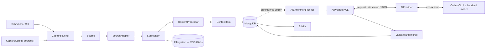

# Shiyi

Shiyi collects information from heterogeneous sources and turns it into canonical `ContentItem` documents for Briefly and other downstream consumers.

The current priority is a stable Briefly data input. Shiyi may later support a broader open-source adapter ecosystem, but it does not own signals, trends, opportunities, ranking, or editorial decisions.

## Architecture



The full model and component diagrams live in [`docs/architecture.md`](docs/architecture.md).
Briefly should integrate through the root-level [`BRIEFLY_INTEGRATION.md`](BRIEFLY_INTEGRATION.md) consumer contract.

## Core language

- `CaptureConfig` declares what to collect.
- `Source` is one independently identifiable target and checkpoint boundary.
- `SourceAdapter` performs source-specific network acquisition.
- `SourceItem` is the transient adapter boundary.
- `ContentProcessor` performs deterministic canonicalization.
- `ContentItem` is the only persisted consumer contract.
- `ContentItemStore` uses MongoDB for hot/query data.
- `BlobStore` uses filesystem initially and COS later for raw, large, or cold bytes.

Multiple targets can share one adapter. For example, `x:openai` and `x:sama` can both use `XCaptureAdapter` while keeping separate source identities and checkpoints.

## Install

```bash
uv sync --dev
```

Shiyi requires Python 3.11 or newer.

## Run

Start MongoDB locally or set `SHIYI_MONGO_URI`, then capture one or more built-in sources:

```bash
uv run shiyi capture \
  --source anthropic \
  --source deepmind-blog \
  --workspace .shiyi
```

Direct public documents reuse the same pipeline. The adapter converts HTML,
Markdown, and text-extractable PDFs to canonical Markdown; when conversion is
needed, it retains the original response bytes in Blob storage:

```bash
uv run shiyi capture \
  --source openai-gpt-live-system-card \
  --source openai-content-provenance \
  --source deepmind-synthid \
  --workspace .shiyi
```

For a bounded source that an ordinary client cannot retrieve but an operator can
review in the official rendered page, capture may receive an explicit snapshot
manifest. Every entry maps one exact public URL to a relative local file and its
SHA-256 digest; a mismatch fails the source, while unmapped URLs keep their
ordinary acquisition path:

```bash
uv run shiyi capture \
  --source openai-gpt-live-engineering \
  --source openai-gpt-live-launch \
  --source openai-content-verification \
  --operator-snapshot-manifest .shiyi/operator-snapshots/2026-08-16/manifest.json \
  --workspace .shiyi
```

The manifest must retain `contentReviewRequired: true`. Snapshot import proves
provenance and content sufficiency only; it is not downstream editorial approval.

List configured built-ins:

```bash
uv run shiyi sources
```

Read ready canonical documents:

```bash
uv run shiyi list --limit 20
uv run shiyi export --source anthropic-news --limit 20
```

Optionally backfill a small batch of missing summaries with the local ChatGPT-authenticated Codex CLI:

```bash
codex login
uv run shiyi enrich --provider codex-cli --summary-language zh --limit 5
```

The command refuses API-key Codex authentication, does not receive MongoDB credentials in its model input, and leaves capture usable when AI is unavailable.

MongoDB defaults to `mongodb://localhost:27017`, database `shiyi`, and collection `content_items`. Raw payload Blobs are stored below `.shiyi/blobs` using content-addressed SHA-256 keys. A PDF without extractable text fails capture instead of becoming a misleading ready document.

## ContentItem

`ContentItem` preserves source identity, source-native identity, kind, canonical URL, title, optional `creators: string[]`, timestamps, original-language Markdown, optional summary/language/labels, objective metrics, content hash, Blob reference, and readiness timestamps.

`ContentItem.id` is the deterministic upsert identity. There is no separate event ledger or duplicate idempotency key.

## AI Provider ACL

AI is optional and runs after deterministic capture. `AIProviderACL` is the only domain-to-provider bridge; current Codex CLI and future API/local implementations sit behind the same `AIProvider` port. The ACL may propose only neutral language, summary, categories, and tags, validates structured output, and never lets AI overwrite source facts. Adapters capture an upstream summary when the source supplies one, and a non-empty summary skips AI entirely.

See [`docs/specs/ai-provider-sdd.md`](docs/specs/ai-provider-sdd.md) for the accepted boundary and Codex CLI security constraints.

## Development

```bash
uv run ruff check .
uv run ruff format --check .
uv run mypy src tests
uv run pytest
```

See [`AGENTS.md`](AGENTS.md) for the MVP design rules and [`docs/specs/scope-sdd.md`](docs/specs/scope-sdd.md) for the accepted product boundary.
