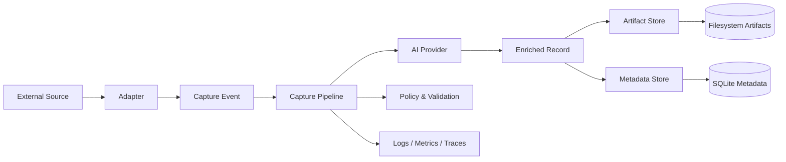

# Shiyi

Shiyi is an open-source information capture pipeline for turning messy external sources into structured, durable, and AI-assisted knowledge.

The project is intentionally designed around three extension points:

- **Adapters** — connect to source systems and normalize raw input into capture events.
- **AI Providers** — enrich, classify, extract, summarize, and evaluate content with interchangeable model backends.
- **Artifact and Metadata Stores** — store raw captures, normalized records, generated artifacts, idempotency state, and audit metadata in user-selected backends.

> Status: early architecture draft. APIs are not stable yet.

## Design goals

1. **Composable capture pipeline** — sources, AI enrichment, and storage should evolve independently.
2. **Open extension model** — users can bring their own Adapter, AI Provider, Artifact Store, or Metadata Store implementation without forking core.
3. **Production-grade quality** — typed contracts, deterministic tests, observable runtime, clear error semantics, and compatibility discipline.
4. **Trustworthy data flow** — raw input, transformations, model outputs, and persistence writes should be traceable and auditable.
5. **Language-first documentation** — English is the primary documentation language until the design stabilizes; other languages will follow later.

## Architecture at a glance



Shiyi core owns orchestration and contracts. Integrations live behind ports.

See [`docs/architecture.md`](docs/architecture.md), [`docs/extension-points.md`](docs/extension-points.md), and [`docs/specs/capture-pipeline-sdd.md`](docs/specs/capture-pipeline-sdd.md) for the current design.

## Repository layout

```text
.
├── docs/
│   ├── architecture.md
│   ├── extension-points.md
│   └── adr/
├── src/
│   └── shiyi/
│       ├── domain/
│       ├── ports/
│       └── pipeline/
└── tests/
```

## Development

Shiyi uses Python-first tooling with strict contracts and fast local feedback.

```bash
uv sync
uv run ruff format --check .
uv run ruff check .
uv run mypy src tests
uv run pytest
```

## License

Apache-2.0. See [`LICENSE`](LICENSE).
