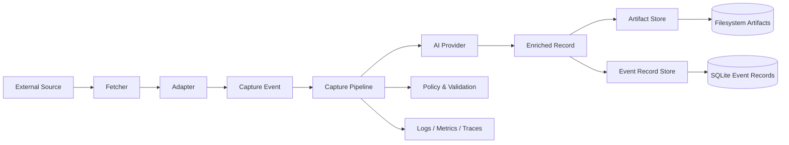

# Shiyi

Shiyi is an open-source information capture pipeline for turning messy external sources into structured, durable, and AI-assisted knowledge.

The project is intentionally designed around three extension points:

- **Fetchers** — retrieve web, RSS, and sitemap source material with shared HTTP policy.
- **Adapters** — parse source-specific data and normalize raw input into capture events.
- **AI Providers** — enrich, classify, extract, summarize, and evaluate content with interchangeable model backends.
- **Artifact Stores and Event Record Stores** — store raw captures, normalized records, generated artifacts, idempotency state, and audit metadata in user-selected backends.

> Status: early architecture draft. APIs are not stable yet.

## Design goals

1. **Composable capture pipeline** — sources, AI enrichment, and storage should evolve independently.
2. **Open extension model** — users can bring their own Adapter, AI Provider, Artifact Store, or Event Record Store implementation without forking core.
3. **Production-grade quality** — typed contracts, deterministic tests, observable runtime, clear error semantics, and compatibility discipline.
4. **Trustworthy data flow** — raw input, transformations, model outputs, and persistence writes should be traceable and auditable.
5. **Language-first documentation** — English is the primary documentation language until the design stabilizes; other languages will follow later.

## Architecture at a glance



Shiyi core owns orchestration and contracts. Integrations live behind ports.

See [`docs/architecture.md`](docs/architecture.md), [`docs/extension-points.md`](docs/extension-points.md), [`docs/specs/capture-pipeline-sdd.md`](docs/specs/capture-pipeline-sdd.md), and [`docs/mvp.md`](docs/mvp.md) for the current design and MVP boundary.

## Repository layout

```text
.
├── docs/
│   ├── architecture.md
│   ├── extension-points.md
│   └── adr/
├── src/
│   └── shiyi/
│       ├── domain/
│       ├── ports/
│       └── pipeline/
└── tests/
```

## Quickstart

Run a local capture into filesystem artifacts plus SQLite event records:

```bash
uv sync
uv run shiyi capture --source openai --workspace .shiyi/openai --max-items 2
uv run shiyi capture --source anthropic --workspace .shiyi/anthropic --max-items 2
```

The CLI prints a JSON summary:

```json
{"artifacts": 4, "enriched_events": 1, "enrichments": 2, "processed": 1, "source": "openai", "total_events": 1, "workspace": ".shiyi/openai"}
```

A second run over the same source should return `"processed": 0` for already-enriched records. This is the MVP idempotency behavior.

For daily capture, prefer a date window plus a small overlap instead of an arbitrary item limit:

```bash
uv run shiyi capture --source openai --workspace .shiyi/openai --since 2026-05-10 --until 2026-05-13 --max-items 100
```

Date windows are half-open: `--since` is inclusive and `--until` is exclusive. For scheduled jobs, use a 2-3 day overlap and let idempotency skip already-enriched records. `--limit` remains as a deprecated debug alias for the item cap.

List captured events with the CLI:

```bash
uv run shiyi list --workspace .shiyi/openai
```

Or inspect metadata directly with SQLite:

```bash
sqlite3 .shiyi/openai/event-records.sqlite \
  "select event_id, idempotency_key, status from events;"
```

Artifacts are stored under:

```text
.shiyi/<source>/artifacts/raw/
.shiyi/<source>/artifacts/normalized/
.shiyi/<source>/artifacts/enrichment/
```

Fetcher raw-cache entries for full article pages are stored separately under:

```text
.shiyi/<source>/data/raw/{source}/{adapter-defined-raw-key}/raw.html
```

Adapters define the raw key from entry-level metadata. A cache hit skips the remote full-page fetch, but pipeline event records still controls whether an event is normalized or enriched.

Current built-in sources:

- `openai` — OpenAI news RSS feed.
- `anthropic` — Anthropic news index parser.

## Live smoke tests

Network-dependent public-source smoke tests are opt-in:

```bash
SHIYI_RUN_LIVE_TESTS=1 uv run pytest tests/live/test_public_sources.py
```

## Development

Shiyi uses Python-first tooling with strict contracts and fast local feedback.

```bash
uv sync
uv run ruff format --check .
uv run ruff check .
uv run mypy src tests
uv run pytest
```

## License

Apache-2.0. See [`LICENSE`](LICENSE).
