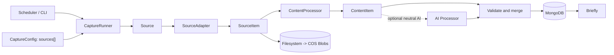

# Shiyi

Shiyi collects information from heterogeneous sources and turns it into canonical `ContentItem` documents for Briefly and other downstream consumers.

The current priority is a stable Briefly data input. Shiyi may later support a broader open-source adapter ecosystem, but it does not own signals, trends, opportunities, ranking, or editorial decisions.

## Architecture



The full model and component diagrams live in [`docs/architecture.md`](docs/architecture.md).

## Core language

- `CaptureConfig` declares what to collect.
- `Source` is one independently identifiable target and checkpoint boundary.
- `SourceAdapter` performs source-specific network acquisition.
- `SourceItem` is the transient adapter boundary.
- `ContentProcessor` performs deterministic canonicalization.
- `ContentItem` is the only persisted consumer contract.
- `ContentItemStore` uses MongoDB for hot/query data.
- `BlobStore` uses filesystem initially and COS later for raw, large, or cold bytes.

Multiple targets can share one adapter. For example, `x:openai` and `x:sama` can both use `XCaptureAdapter` while keeping separate source identities and checkpoints.

## Install

```bash
uv sync --dev
```

Shiyi requires Python 3.11 or newer.

## Run

Start MongoDB locally or set `SHIYI_MONGO_URI`, then capture one or more built-in sources:

```bash
uv run shiyi capture \
  --source anthropic \
  --source deepmind-blog \
  --workspace .shiyi
```

List configured built-ins:

```bash
uv run shiyi sources
```

Read ready canonical documents:

```bash
uv run shiyi list --limit 20
uv run shiyi export --source anthropic-news --limit 20
```

MongoDB defaults to `mongodb://localhost:27017`, database `shiyi`, and collection `content_items`. Raw payload Blobs are stored below `.shiyi/blobs` using content-addressed SHA-256 keys.

## ContentItem

`ContentItem` preserves source identity, source-native identity, kind, canonical URL, title, optional `creators: string[]`, timestamps, original-language Markdown, optional summary/language/labels, objective metrics, content hash, Blob reference, and readiness timestamps.

`ContentItem.id` is the deterministic upsert identity. There is no separate event ledger or duplicate idempotency key.

## AI boundary

AI is optional. It may propose neutral language, summary, categories, and tags. Adapters capture an upstream summary when the source supplies one; a non-empty summary skips AI summarization and always wins during deterministic merging. AI cannot overwrite source facts, and AI failure cannot lose captured deterministic content.

## Development

```bash
uv run ruff check .
uv run ruff format --check .
uv run mypy src tests
uv run pytest
```

See [`AGENTS.md`](AGENTS.md) for the MVP design rules and [`docs/specs/scope-sdd.md`](docs/specs/scope-sdd.md) for the accepted product boundary.
