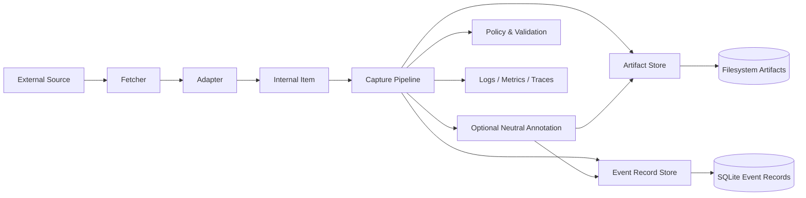

# Shiyi

Shiyi is an open-source information capture and normalization pipeline for turning messy external sources into durable, canonical, replay-safe knowledge artifacts.

The project is intentionally scoped as shared capture infrastructure:

```text
Shiyi = Capture + Normalize + Neutral Preprocess + Distribution
Briefly / AI Insight / Demand Radar = Domain Enrichment + Ranking + Product Output
```

Core extension points:

- **Fetchers** — retrieve web, RSS, and sitemap source material with shared HTTP policy.
- **Adapters** — parse source-specific data and normalize raw input into internal items.
- **Normalizers** — turn source payloads into canonical Markdown/text or structured artifacts.
- **AI Providers** — optionally produce neutral, reusable annotations such as summaries, entities, coarse topics, language, quality signals, chunks, or embeddings.
- **Artifact Stores and Event Record Stores** — store raw captures, normalized records, optional neutral annotations, idempotency state, and audit metadata in user-selected backends.

> Status: early architecture draft. APIs are not stable yet.

## Design goals

1. **Composable capture pipeline** — sources, normalization, optional neutral preprocessing, and storage should evolve independently.
2. **Open extension model** — users can bring their own Adapter, Normalizer, AI Provider, Artifact Store, or Event Record Store implementation without forking core.
3. **Production-grade quality** — typed contracts, deterministic tests, observable runtime, clear error semantics, and simple MVP-first evolution.
4. **Trustworthy data flow** — raw input, transformations, model outputs, and persistence writes should be traceable and auditable.
5. **Language-first documentation** — English is the primary documentation language until the design stabilizes; other languages will follow later.

## Architecture at a glance



Shiyi core owns orchestration and contracts. Integrations live behind ports.

Repository docs are the source of truth for product and design decisions. Notion may track tasks, owners, dates, and status, but should not be the canonical product spec.

Start with the project-level docs first: [`docs/PRODUCT_SPEC.md`](docs/PRODUCT_SPEC.md), [`docs/MILESTONES.md`](docs/MILESTONES.md), [`docs/SOURCE_STRATEGY.md`](docs/SOURCE_STRATEGY.md), and [`docs/testing-boundary.md`](docs/testing-boundary.md). Use [`docs/architecture.md`](docs/architecture.md), [`docs/extension-points.md`](docs/extension-points.md), and [`docs/specs/*.md`](docs/specs/) for implementation-facing details. Dated progress reviews and process notes should be distilled into these docs, then removed from tracked repository docs.

## Repository layout

```text
.
├── docs/
│   ├── PRODUCT_SPEC.md
│   ├── MILESTONES.md
│   ├── SOURCE_STRATEGY.md
│   ├── architecture.md
│   ├── extension-points.md
│   ├── specs/
│   └── adr/
├── src/
│   └── shiyi/
│       ├── domain/
│       ├── ports/
│       └── pipeline/
└── tests/
```

## Quickstart

Run a local capture into filesystem artifacts plus SQLite event records:

```bash
uv sync
uv run shiyi capture --source openai --workspace .shiyi/openai --max-items 2
uv run shiyi capture --source anthropic --workspace .shiyi/anthropic --max-items 2
uv run shiyi capture --source deepseek-news --workspace .shiyi/deepseek-news --max-items 2
```

The CLI prints a JSON summary:

```json
{"artifacts": 4, "enriched_events": 1, "enrichments": 2, "processed": 1, "source": "openai", "total_events": 1, "workspace": ".shiyi/openai"}
```

A second run over the same source should return `"processed": 0` for already-complete records. This is the MVP idempotency behavior. Optional local heuristic annotations are recorded as enrichment artifacts.

For daily capture, prefer a date window plus a small overlap instead of an arbitrary item limit:

```bash
uv run shiyi capture --source openai --workspace .shiyi/openai --since 2026-05-10 --until 2026-05-13 --max-items 100
```

Date windows are half-open: `--since` is inclusive and `--until` is exclusive. For scheduled jobs, use a 2-3 day overlap and let idempotency skip already-complete records. `--limit` remains as a deprecated debug alias for the item cap.

List captured records with the CLI:

```bash
uv run shiyi list --workspace .shiyi/openai
```

Export normalized content for upstream consumers by captured time and source kind:

```bash
uv run shiyi export --workspace .shiyi/openai --since 2026-05-12 --until 2026-05-13 --source blog --limit 20
```

The export output is JSON and contains Shiyi trace fields plus `normalized_content`; consumers do not need third-party source DTOs.

Or inspect metadata directly with SQLite:

```bash
sqlite3 .shiyi/openai/event-records.sqlite \
  "select event_id, idempotency_key, status from events;"
```

Artifacts are stored under:

```text
.shiyi/<source>/artifacts/raw/
.shiyi/<source>/artifacts/normalized/
.shiyi/<source>/artifacts/enrichment/
```

Fetcher raw-cache entries for full article pages are stored separately under:

```text
.shiyi/<source>/data/raw/{source}/{adapter-defined-raw-key}/raw.html
```

Adapters define the raw key from entry-level metadata. A cache hit skips the remote full-page fetch, but pipeline event records still control whether an event is normalized and complete.

Current built-in sources:

- `openai` — OpenAI news RSS feed.
- `anthropic` — Anthropic news index parser.
- `huggingface-blog` — Hugging Face Blog RSS feed.
- `google-research-blog` — Google Research Blog RSS feed.
- `deepseek-news` — DeepSeek official news article pages discovered from API docs updates.
- `z-ai-blog` — Z.ai / GLM official blog posts discovered from release notes.
- `moonshot-kimi-changelog` — Kimi Open Platform changelog.
- `bytedance-seed-blog` — ByteDance Seed official blog, Chinese primary with English fallback metadata.

## Live smoke tests

Network-dependent public-source smoke tests are opt-in:

```bash
SHIYI_RUN_LIVE_TESTS=1 uv run pytest tests/live/test_public_sources.py
```

## Development

Shiyi uses Python-first tooling with strict contracts and fast local feedback.

```bash
uv sync
uv run ruff format --check .
uv run ruff check .
uv run mypy src tests
uv run pytest
```

## License

Apache-2.0. See [`LICENSE`](LICENSE).
