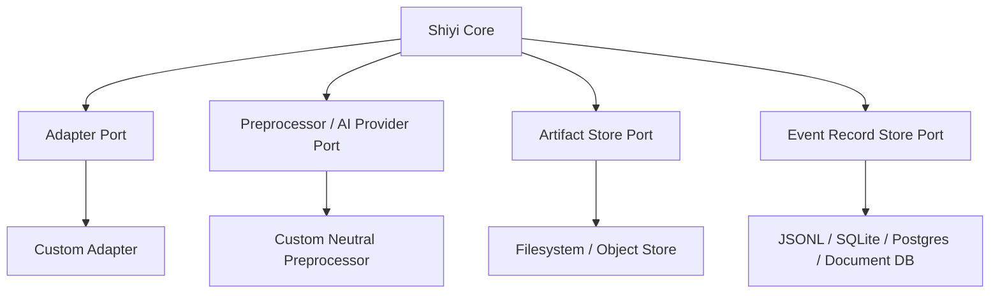

# Shiyi Architecture

## 1. Problem statement

Information capture tools usually become tightly coupled to a small set of sources, model vendors, and storage backends. That makes them hard to adapt, hard to audit, and hard to operate once the user workflow grows beyond the original assumptions.

Shiyi defines a general capture and normalization pipeline where the core system coordinates the workflow, while source-specific ingestion, optional neutral preprocessing, and storage are user-replaceable.

## 2. Architectural principles

- **Core owns policy and orchestration, not integrations.** Integrations implement stable ports.
- **Raw data is never silently discarded.** Every normalized record should retain provenance back to its source event.
- **Optional preprocessing is neutral.** AI-assisted work inside Shiyi must produce reusable facts or annotations, not business opinions.
- **Idempotency is mandatory.** Replaying the same source event should not corrupt state or duplicate durable records.
- **Observability is part of the contract.** Every pipeline run should expose trace IDs, structured logs, and measurable outcomes.
- **Compatibility is explicit.** Public contracts must follow semantic versioning once stabilized.

## 3. Domain model

### Capture Source

An external system that can produce information: RSS, web pages, email, chat, documents, APIs, local files, or future custom sources.

### Adapter

A user-provided component that reads from a source and emits `CaptureEvent` objects. Adapters are responsible for source authentication, pagination, rate limiting, and source-specific checkpoint hints.

### Capture Event

The normalized boundary object entering Shiyi core. It contains identity, payload, metadata, provenance, and optional attachments.

### Pipeline Run

A single execution context that processes one or more capture events through validation, raw persistence, normalization, optional neutral preprocessing, event-record persistence, and telemetry.

### Preprocessor / AI Provider

An optional user-provided component for neutral preprocessing tasks such as language detection, neutral summaries, entity extraction, coarse topic annotation, deduplication assistance, quality signals, chunking, or embeddings. Product-specific insight generation belongs to downstream consumers, not Shiyi core.

### Persistence

Persistence is a family of user-provided storage components. The MVP separates artifact storage from event-record storage instead of assuming one database. Raw documents and generated files are stored in a filesystem-backed artifact store; event records start with SQLite and can later move to Postgres, document databases, or other backends. Checkpointing is deferred for the MVP.

## 4. Pipeline stages

1. **Discover** — adapter discovers candidate source items.
2. **Normalize** — adapter emits stable `CaptureEvent` objects.
3. **Validate** — core validates event schema, size limits, provenance, and required fields.
4. **Deduplicate** — core checks event identity and content fingerprints.
5. **Persist artifacts** — core stores raw and normalized artifacts through an artifact store.
6. **Optional neutral preprocess** — core may invoke a preprocessor/AI provider for reusable annotations.
7. **Policy check** — core validates preprocess output, user policy, and persistence rules.
8. **Persist event records** — core records event status, artifact references, annotation references, and failures.
9. **Observe** — logs, metrics, traces, and run summaries are emitted.

## 5. Ports and adapters

Shiyi core exposes these primary ports:

- `AdapterPort`
- `PreprocessorPort` / transitional `AIProviderPort`
- `ArtifactStorePort`
- `EventRecordStorePort`

All ports should be asynchronous, cancellable, typed, and testable with contract test suites.

## 6. Error model

Errors should be classified before they cross core boundaries:

- `InvalidInputError` — malformed event or unsupported payload.
- `TransientSourceError` — retryable adapter/source failure.
- `RateLimitError` — source or model provider throttling.
- `PolicyViolationError` — output rejected by configured policy.
- `PersistenceConflictError` — idempotency or version conflict.
- `FatalIntegrationError` — integration cannot safely continue.

Retry strategy must be explicit and observable. No hidden infinite retries.

## 7. Quality bar

Shiyi should align with top-tier open-source infrastructure projects:

- Public API contracts have examples and contract tests.
- Core pipeline has deterministic unit tests and integration test harnesses.
- CI runs type checking, tests, linting, and documentation checks.
- Changes to public contracts require an ADR or RFC.
- Releases publish changelogs and migration notes.
- Security-sensitive code paths receive explicit review.

## 8. Initial non-goals

- Shiyi is not a hosted SaaS product.
- Shiyi does not require one default model provider.
- Shiyi does not require a server database. The MVP default is filesystem-first artifacts with SQLite event records.
- Shiyi does not own product-specific ranking, scoring, insight, or editorial decisions.
- Shiyi does not make AI/preprocess output authoritative without validation.
