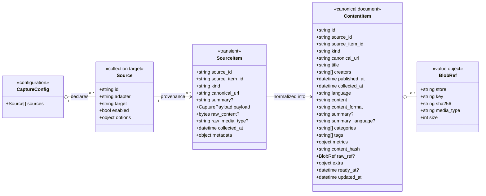

# Shiyi Architecture

- Status: Accepted
- Last updated: 2026-07-19
- Priority: Briefly-first MVP

## 1. Positioning

Shiyi is information collection and canonicalization infrastructure. It collects content from heterogeneous external sources and produces stable, source-neutral `ContentItem` documents for Briefly and future consumers.

Shiyi may eventually collect news, blogs, videos, social posts, forum threads, repositories, and other public information. Shiyi does not decide whether that information represents a signal, trend, opportunity, recommendation, or editorial conclusion. Those interpretations belong downstream.

The current objective is narrower than the eventual open-source ambition: provide Briefly with a reliable, idempotent data input. Adapter breadth, third-party plugin ergonomics, and compatibility guarantees must not slow that objective.

## 2. Scope boundary

```text
Shiyi:
SourceItem -> ContentItem

Downstream consumers:
ContentItem -> Signal / Trend / Opportunity / Ranking / Editorial Decision
```

Shiyi owns:

- configured source collection;
- acquisition of original content and objective source metadata;
- source-neutral field mapping and content normalization;
- provenance, deterministic identity, hashing, and deduplication;
- optional neutral language, summary, and simple classification fields;
- idempotent persistence and a stable Briefly read contract.

Shiyi does not own:

- business conclusions or opportunity discovery;
- importance, credibility, recommendation, or editorial scores;
- cross-source topic interpretation or product-specific ranking;
- a generic AI task system;
- a production plugin ecosystem during the Briefly-first MVP.

## 3. Execution model

The execution entry point is `CaptureRunner`, not `Source` or `SourceAdapter`.

```text
Scheduler / CLI
-> CaptureRunner
-> Source selected from CaptureConfig
-> SourceAdapter
-> SourceItem
-> ContentProcessor
-> ContentItem
-> ContentItemStore
```

Optional AI is a separate post-capture flow:

```text
Scheduler / CLI
-> AIEnrichmentRunner
-> ContentItemStore.list_missing_summary()
-> AIProviderACL
-> AIProvider
-> deterministic validation and upsert
```

### CaptureConfig

`CaptureConfig` declaratively defines what to collect. It contains enabled `Source` entries and target-specific options; it performs no network work.

One `Source` represents one independently identifiable collection target and checkpoint boundary. Multiple targets on the same platform share one adapter implementation.

For example, two configured X accounts share `XCaptureAdapter` but remain separate sources:

```yaml
sources:
  - id: x:openai
    adapter: x
    target: openai

  - id: x:sama
    adapter: x
    target: sama
```

This keeps scheduling configuration unified while preserving independent identity, replay, failure isolation, and checkpoints for each target.

### CaptureRunner

`CaptureRunner` is invoked by a scheduler or CLI. For every enabled source it:

1. resolves the adapter implementation from `Source.adapter`;
2. asks the adapter to capture that source target;
3. validates each emitted `SourceItem`;
4. normalizes it into a canonical `ContentItem`;
5. persists deterministic output idempotently.

`CaptureRunner` does not call AI. This ensures subscription limits, authentication failures, or provider failures cannot delay or invalidate capture.

### SourceAdapter

`SourceAdapter` performs the real source-specific acquisition. Implementations such as `XCaptureAdapter`, `RedditCaptureAdapter`, and `RssCaptureAdapter` own API/HTTP behavior, authentication, pagination, rate limits, payload parsing, and checkpoint progress.

An adapter receives a `Source`; it does not decide which sources should run.

A bounded operator snapshot is an acquisition exception, not a second ingest
pipeline. The CLI may inject one explicit manifest that maps exact public URLs
to relative local files, acquisition timestamps, media types, and SHA-256
digests. The fetcher verifies the digest at read time and delegates every
unmapped URL to ordinary acquisition. The resulting bytes still pass through
the selected `SourceAdapter`, `SourceItem`, `ContentProcessor`, Blob store, and
canonical `ContentItemStore`. The manifest must preserve a visible
`contentReviewRequired` gate; using a snapshot never implies downstream
editorial approval.

## 4. Domain model



### Naming rules

Only the two core data units use the `Item` suffix:

- `SourceItem` is the transient Adapter -> Processor boundary;
- `ContentItem` is the canonical persisted and consumer-facing boundary.

Supporting concepts do not receive an `Item` suffix.

`creators` is an optional `string[]`, not a separate model. It preserves reliable source attribution where useful without making author identity a required concept for forums, anonymous posts, deleted accounts, repositories, or machine-generated content. Missing creators never block readiness.

### ContentItem identity

`ContentItem.id` is Shiyi's deterministic global identity and the idempotent upsert key. `source_item_id` retains the source-native identity. There is no second `idempotency_key` field.

The identifier must remain stable for repeated capture of the same logical source item. `content_hash` detects content changes independently from identity.

## 5. Component model

```mermaid
flowchart LR
    subgraph ENTRY["Execution entry"]
        SCHEDULER["Scheduler"]
        CLI["CLI / Manual run"]
    end

    subgraph SHIYI["Shiyi scope"]
        direction LR

        subgraph PROGRAM["Deterministic program"]
            CONFIG["CaptureConfig: declares targets"]
            RUNNER["CaptureRunner: orchestrates the run"]
            SOURCE["Source: target and checkpoint boundary"]
            RESOLVER["Adapter resolver"]
            ADAPTER["SourceAdapter: X / Reddit / RSS"]
            SOURCE_ITEM["SourceItem"]
            PROCESSOR["ContentProcessor: fields, Markdown, ID, hash"]
            CONTENT_ITEM["ContentItem"]
            ENRICHER["AIEnrichmentRunner: selects summary == empty"]
            AI_ACL["AIProviderACL: map request and validate output"]
            CODEX_PROVIDER["CodexCLIProvider: isolated subprocess adapter"]
            MERGER["Validate and merge allowed AI fields"]
            READINESS["Ready policy and idempotent upsert"]
        end

        subgraph AI["LLM - optional"]
            CODEX_MODEL["Codex subscribed model: summary, language, simple labels"]
        end

        subgraph STORAGE["Storage"]
            MONGO[("MongoDB: canonical ContentItem store")]
            BLOB[("Filesystem -> COS: raw, large, cold blobs")]
        end

        CONFIG -- "sources[]" --> RUNNER
        RUNNER -- "select enabled source" --> SOURCE
        SOURCE -- "adapter + target + options" --> RESOLVER
        RESOLVER --> ADAPTER
        ADAPTER --> SOURCE_ITEM
        SOURCE_ITEM --> PROCESSOR
        PROCESSOR --> CONTENT_ITEM

        SOURCE_ITEM -- "preserved response bytes or payload bytes" --> BLOB
        BLOB -- "BlobRef" --> CONTENT_ITEM

        CONTENT_ITEM -- "deterministic result" --> READINESS
        READINESS --> MONGO
        MONGO -. "bounded missing-summary query" .-> ENRICHER
        ENRICHER --> AI_ACL
        AI_ACL <-->|"AIProvider request / structured JSON"| CODEX_PROVIDER
        CODEX_PROVIDER <-->|"ephemeral codex exec"| CODEX_MODEL
        AI_ACL --> MERGER
        MERGER -- "same ContentItem id" --> MONGO
    end

    subgraph EXTERNAL["External sources"]
        X["X"]
        REDDIT["Reddit"]
        RSS["News / Blog / RSS"]
        OTHER["Video / GitHub / Others"]
    end

    subgraph DOWNSTREAM["Downstream - outside Shiyi"]
        BRIEFLY["Briefly"]
        INSIGHT["Signal / Trend / Opportunity"]
    end

    SCHEDULER --> RUNNER
    CLI --> RUNNER
    SCHEDULER -. "optional enrichment" .-> ENRICHER
    CLI -. "explicit enrich command" .-> ENRICHER

    ADAPTER <-->|"API / HTTP"| X
    ADAPTER <-->|"API / HTTP"| REDDIT
    ADAPTER <-->|"API / HTTP"| RSS
    ADAPTER <-->|"API / HTTP"| OTHER

    MONGO --> BRIEFLY
    MONGO --> INSIGHT
```



## 6. Deterministic and AI boundaries

Deterministic code owns:

- configuration loading and source selection;
- adapter resolution and collection;
- validation and source fact mapping;
- canonical URL handling and Markdown conversion;
- identity, hashing, deduplication, and checkpoints;
- missing-summary selection and batching;
- provider request construction and provider-result schema validation;
- AI output validation, allowed-field merging, readiness, and persistence.

AI is optional and may produce only neutral reusable fields:

- original-language detection;
- neutral summary and `summary_language`;
- simple categories or tags.

Adapters capture a source-provided summary into `SourceItem.summary`. Deterministic processing promotes it to `ContentItem.summary`; when that field is non-empty, `AIEnrichmentRunner` does not select the item. AI must not overwrite source facts. AI failure leaves the deterministic MongoDB document unchanged and eligible for a later bounded retry because its summary remains empty.

`AIProviderACL` is the only domain-to-provider boundary. It accepts canonical content, emits a narrow `AIProviderRequest`, rejects missing, duplicate, or unexpected result IDs, validates allowed fields, and maps the result back to `AIContentFields`. `CodexCLIProvider` owns CLI authentication, isolation, and structured subprocess execution. Future API or local-model implementations replace that provider without changing the runner, ACL, merge rules, or `ContentItem`.

Shiyi does not expose an open-ended task/extraction system during the MVP.

## 7. Storage

MongoDB is the canonical hot/query store for Briefly-facing `ContentItem` documents. Flexible arrays such as `categories`, `tags`, and `creators`, optional fields, and variable content length fit the document boundary.

The filesystem is the initial Blob store. COS can later replace or supplement it for raw, oversized, or cold content. MongoDB retains the identity, provenance, query fields, summary, labels, metrics, and `BlobRef`; FS/COS retains the referenced bytes. Most adapters use their emitted payload as the raw representation. An adapter that must transform a binary response, such as PDF-to-Markdown capture, supplies paired `SourceItem.raw_content` and `raw_media_type` so the Blob remains the acquired source rather than the derived text.

Shiyi must not maintain SQLite event records, filesystem export documents, and MongoDB documents as competing canonical truths. Derived exports and raw blobs are not alternative `ContentItem` authorities.

Briefly reads only MongoDB and may use `ready_at != null` as the initial readiness contract.

## 8. Minimal ports

The MVP core needs only these replaceable boundaries:

```python
class SourceAdapter(Protocol):
    def capture(self, source: Source) -> AsyncIterator[SourceItem]: ...


class ContentProcessor(Protocol):
    async def process(self, item: SourceItem) -> ContentItem: ...


class ContentItemStore(Protocol):
    async def get(self, item_id: str) -> ContentItem | None: ...
    async def upsert(self, item: ContentItem) -> None: ...


class BlobStore(Protocol):
    async def put(self, content: bytes, *, media_type: str) -> BlobRef: ...


class AIProvider(Protocol):
    name: str
    async def complete(self, request: AIProviderRequest) -> dict[str, Any]: ...
```

The first four ports serve deterministic capture and storage. `AIProvider` is optional and is reachable only through `AIProviderACL` after capture; it is not part of capture correctness.

Do not add generic event ledgers, annotation artifact families, compatibility adapters, runtime plugin systems, or task graphs unless a concrete Briefly MVP requirement proves they are needed.

## 9. Operational rules

- Repeated runs must not create duplicate `ContentItem` records or Blob objects.
- One source failure must not prevent other configured sources from running.
- Retries must be bounded and observable.
- Raw content should remain auditable through `BlobRef` when retained outside MongoDB.
- Source-specific DTOs and payload shapes must stop at `SourceAdapter`.
- Briefly must not read `SourceItem`, adapter internals, or runner state.
