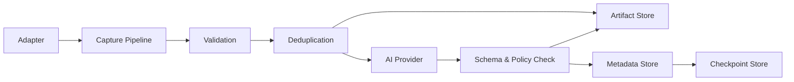

# Shiyi Capture Pipeline SDD

- Status: Draft
- Owner: Shiyi contributors
- Last updated: 2026-05-12
- Scope: MVP capture pipeline, extension contracts, and filesystem-first persistence design

## 1. Purpose

This document specifies the first implementation slice of Shiyi using Specification-Driven Development. The goal is to make the behavior, contracts, and storage boundaries precise before expanding implementation.

Shiyi captures information from external sources, normalizes it into durable events, optionally enriches it with AI, and persists both source artifacts and structured metadata in user-controlled backends.

## 2. MVP goals

The MVP must support:

1. A source adapter that emits normalized `CaptureEvent` objects.
2. A pipeline runner that validates, deduplicates, enriches, persists, and checkpoints events.
3. AI provider contracts for structured enrichment.
4. Filesystem-first artifact persistence for raw and generated documents.
5. Lightweight metadata/checkpoint persistence that can start with local files and later move to SQLite/Postgres/document databases.
6. Deterministic local tests for domain validation, pipeline behavior, idempotency, and persistence semantics.

## 3. Non-goals

The MVP will not provide:

- A hosted service.
- A web UI.
- A required relational database.
- A required document database.
- A required model provider.
- Distributed workers.
- Full-text or vector search as a core dependency.
- Multi-tenant authorization.

These can be added as optional packages after the core contracts stabilize.

## 4. Design principles

### 4.1 Contract-first

All extension points must be defined as explicit Python protocols plus Pydantic models before implementation-specific behavior is added.

### 4.2 Filesystem-first artifacts

Article bodies, raw HTML, markdown, extracted text, attachments, and AI result JSON are artifacts. The default MVP should store them on the filesystem because that is simple, inspectable, backup-friendly, and avoids premature database coupling.

### 4.3 Metadata is separate from artifacts

Metadata required for pipeline control must not be mixed with artifact blobs. Metadata includes idempotency keys, fingerprints, adapter checkpoints, pipeline run state, processing status, and artifact references.

### 4.4 AI output is untrusted

AI output must be schema-validated and policy-checked before it is treated as an enriched record.

### 4.5 Replay safety

Re-running the same adapter over the same source item must not create duplicate logical records or corrupt checkpoints.

### 4.6 Backend neutrality

Core must not assume SQLite, Postgres, MongoDB, S3, or any model provider. Those are implementations behind ports.

## 5. Core concepts

### 5.1 Adapter

An adapter connects an external source to Shiyi. It owns source-specific concerns such as authentication, pagination, rate limits, and raw item discovery.

An adapter emits `CaptureEvent` objects. It must not directly call AI providers or final persistence stores.

### 5.2 CaptureEvent

A `CaptureEvent` is the normalized boundary object entering the pipeline.

Required fields:

- `id`: stable event ID within Shiyi.
- `source`: source identity, including source kind and optional URI/account.
- `occurred_at`: source event timestamp when available, otherwise fetch/discovery time.
- `payload`: typed payload (`text`, `html`, or `binary`).
- `provenance`: adapter name/version, source item ID, and fetch timestamp.
- `idempotency_key`: stable logical identity for deduplication.
- `metadata`: optional structured metadata.

### 5.3 Artifact

An artifact is durable content stored outside the metadata index.

Examples:

- Raw HTML fetched from a page.
- Cleaned markdown.
- Extracted plain text.
- Screenshot or PDF attachment.
- AI provider raw response.
- Validated enrichment JSON.

Artifacts are addressed by `artifact_ref`, not embedded into metadata tables/documents once they become large or binary.

### 5.4 Metadata record

A metadata record describes what exists and how the pipeline should operate.

Examples:

- Event ID and idempotency key.
- Content fingerprint.
- Current status: discovered, persisted, enriched, failed, skipped.
- Artifact references.
- Last error.
- Retry count.
- Checkpoint cursor.

### 5.5 Enrichment task

An enrichment task asks an AI provider to transform a capture event into structured output.

Initial task types:

- `summarize`
- `extract`
- `classify`

The MVP should prioritize `extract` and `summarize` for article capture. `classify` can remain supported by contract but does not need a rich default implementation.

## 6. Target architecture



## 7. Extension ports

### 7.1 Adapter port

Responsibilities:

- Discover source items.
- Normalize source data into `CaptureEvent`.
- Provide stable idempotency keys.
- Surface retryable and non-retryable source errors.
- Respect source rate limits.

Contract shape:

```python
class Adapter(Protocol):
    @property
    def name(self) -> str: ...

    @property
    def version(self) -> str: ...

    def discover(self, checkpoint: Checkpoint | None = None) -> AsyncIterator[CaptureEvent]: ...
```

### 7.2 AIProvider port

Responsibilities:

- Execute typed enrichment tasks.
- Return structured `EnrichmentResult` objects.
- Surface model identity and usage metadata.
- Avoid persistence side effects.

Contract shape:

```python
class AIProvider(Protocol):
    @property
    def name(self) -> str: ...

    async def run(self, task: EnrichmentTask, event: CaptureEvent) -> EnrichmentResult: ...
```

### 7.3 ArtifactStore port

Responsibilities:

- Store raw and generated artifacts.
- Return stable artifact references.
- Support content-addressed writes where possible.
- Preserve media type, size, checksum, and creation time.

MVP default: local filesystem.

Expected contract shape:

```python
class ArtifactStore(Protocol):
    async def put(self, artifact: ArtifactWrite) -> ArtifactRef: ...
    async def get(self, ref: ArtifactRef) -> ArtifactRead: ...
    async def exists(self, ref: ArtifactRef) -> bool: ...
```

### 7.4 MetadataStore port

Responsibilities:

- Track event records and processing status.
- Enforce idempotency.
- Store artifact references.
- Store enrichment record references.
- Support query patterns needed by the pipeline.

MVP default options:

1. JSONL manifest for the simplest local prototype.
2. SQLite for reliable idempotency and status updates.

The first production-quality local default should likely be SQLite metadata + filesystem artifacts.

### 7.5 CheckpointStore port

Responsibilities:

- Store adapter checkpoint cursors.
- Commit checkpoints only after successful event processing.
- Keep checkpoint writes separate from artifact writes.

Checkpoint semantics must be explicit because incorrect checkpoints cause data loss.

## 8. Storage design

### 8.1 Default MVP storage layout

The default filesystem-backed project workspace should use a deterministic layout:

```text
.shiyi/
├── artifacts/
│   ├── raw/
│   ├── normalized/
│   └── enrichment/
├── metadata/
│   ├── events.jsonl
│   ├── enrichments.jsonl
│   └── failures.jsonl
└── checkpoints/
    └── <adapter-name>.json
```

This layout is intentionally simple and inspectable. It should be easy to back up, diff, and debug.

### 8.2 Future storage implementations

Future persistence packages can provide:

- Filesystem artifact store.
- S3-compatible artifact store.
- SQLite metadata store.
- Postgres metadata store.
- MongoDB/document metadata store.
- Search index store.
- Vector index store.

Core must not require any of them.

### 8.3 Document database position

Document databases are appropriate for flexible extracted article records and nested metadata. They should be supported as a `MetadataStore` implementation, not assumed by core.

For MVP, a document database is probably heavier than needed unless the first real use case requires remote sync, concurrent writers, or flexible querying immediately.

## 9. Pipeline lifecycle

### 9.1 Happy path

For each event emitted by an adapter:

1. Validate `CaptureEvent` schema.
2. Compute or verify content fingerprint.
3. Check idempotency key in metadata store.
4. Persist raw artifact if needed.
5. Create or update metadata record as `persisted`.
6. Run configured enrichment tasks.
7. Validate AI output.
8. Persist enrichment artifacts.
9. Update metadata record as `enriched`.
10. Commit checkpoint after all required processing succeeds.
11. Emit structured logs and metrics.

### 9.2 Duplicate event

If the idempotency key already exists:

- The pipeline must not create a duplicate logical record.
- It may skip processing if the existing record is complete.
- It may resume missing enrichment if prior processing was incomplete.
- It must not advance checkpoint in a way that skips unprocessed items.

### 9.3 Partial failure

If raw artifact persistence succeeds but enrichment fails:

- Metadata status becomes `failed` or `partially_enriched`.
- Failure reason and retry count are recorded.
- Checkpoint behavior depends on adapter ordering semantics:
  - For strictly ordered sources, do not advance checkpoint past failed required events.
  - For unordered sources, checkpoint may advance if the event is safely resumable by idempotency key.

### 9.4 AI validation failure

If AI output fails schema validation:

- Store raw provider response as an artifact for debugging when allowed by policy.
- Mark enrichment as `rejected`.
- Do not publish the rejected result as a valid enriched record.

## 10. Idempotency and fingerprints

### 10.1 Idempotency key

Adapters should provide stable idempotency keys using source-specific identity.

Recommended format:

```text
<source-kind>:<source-account-or-space>:<source-item-id-or-canonical-url>
```

### 10.2 Content fingerprint

The pipeline should compute a content fingerprint from normalized payload content.

Fingerprints support:

- Detecting changed source content under the same source ID.
- Avoiding duplicate artifacts.
- Supporting future recapture/versioning.

### 10.3 Versioning

If the same idempotency key appears with a different fingerprint, the metadata store must represent this as either:

- A new version of the same logical item, or
- A conflict requiring policy decision.

The MVP should record the conflict explicitly instead of silently overwriting.

## 11. Error model

Initial error categories:

- `InvalidInputError`: malformed event or unsupported payload.
- `TransientSourceError`: retryable adapter/source failure.
- `RateLimitError`: source or model provider throttling.
- `AIProviderError`: model/provider failure.
- `ValidationError`: AI output or event validation failure.
- `PolicyViolationError`: output rejected by configured policy.
- `ArtifactStoreError`: artifact read/write failure.
- `MetadataStoreError`: metadata read/write failure.
- `CheckpointError`: checkpoint commit/read failure.
- `FatalIntegrationError`: integration cannot safely continue.

Errors must be observable and typed. Hidden retries are not allowed.

## 12. Observability

Every pipeline run should produce:

- `run_id`
- `trace_id`
- adapter name/version
- event count discovered
- event count processed
- duplicate count
- failure count
- enrichment task count
- artifact bytes written
- latency per major stage

The MVP can implement structured logs first. Metrics/tracing can follow.

## 13. Security and privacy

- Secrets must not be stored in `CaptureEvent` metadata.
- Raw artifacts may contain private data; default local storage must be easy to locate and delete.
- AI provider calls must be explicit and configurable.
- Future remote stores must document encryption and credential behavior.
- Logs must avoid dumping full article bodies or raw provider responses by default.

## 14. Testing strategy

### 14.1 Unit tests

Required:

- Domain model validation.
- Idempotency key handling.
- Fingerprint calculation.
- Artifact reference generation.
- Pipeline branch behavior.

### 14.2 Contract tests

Each extension port should eventually have shared tests:

- Adapter contract tests.
- AI provider contract tests.
- Artifact store contract tests.
- Metadata store contract tests.
- Checkpoint store contract tests.

Third-party implementations should be able to run these tests.

### 14.3 Integration tests

MVP integration tests should cover:

- Fake adapter + fake AI provider + filesystem persistence.
- Duplicate event replay.
- AI validation failure.
- Partial failure and retry.
- Checkpoint commit ordering.

## 15. Implementation plan

### Phase 1: Refine contracts

- Add `ArtifactRef`, `ArtifactWrite`, `ArtifactRead` domain models.
- Split current `Persistence` into `ArtifactStore`, `MetadataStore`, and `CheckpointStore`.
- Keep an aggregate convenience implementation only if it does not hide semantics.

### Phase 2: Filesystem-first persistence

- Implement local filesystem artifact store.
- Implement JSONL or SQLite metadata store.
- Implement checkpoint store.
- Add contract tests for all stores.

### Phase 3: Pipeline correctness

- Add validation stage.
- Add fingerprinting.
- Add idempotency check.
- Add status transitions.
- Add explicit failure handling.
- Add checkpoint commit semantics.

### Phase 4: First real adapter and provider

- Add a simple web/article adapter.
- Add a basic AI provider implementation.
- Add one end-to-end capture example.

### Phase 5: Release hygiene

- Add CLI entrypoint.
- Add examples.
- Add changelog.
- Add API docs.
- Mark unstable public contracts clearly.

## 16. Open questions

1. Should MVP metadata start with JSONL for maximum simplicity or SQLite for safer idempotency?
2. Should article content be normalized to markdown as the default canonical artifact?
3. Should `CaptureEvent` remain source-generic, or should Shiyi introduce a higher-level `DocumentRecord` for article-like content?
4. Should AI enrichment tasks be configured per adapter or globally per pipeline run?
5. Should checkpoint semantics be adapter-specific, or should core require a common ordering model?
6. What is the first real source adapter: web page, RSS, local files, or something else?
