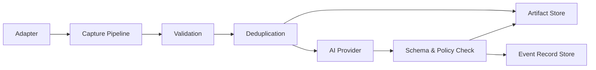

# Shiyi Capture Pipeline SDD

- Status: Draft
- Owner: Shiyi contributors
- Last updated: 2026-05-12
- Scope: MVP capture pipeline, extension contracts, filesystem artifacts, and SQLite event records

## 1. Purpose

This document specifies the first implementation slice of Shiyi using Specification-Driven Development. The goal is to make the behavior, contracts, and storage boundaries precise before expanding implementation.

Shiyi captures information from external sources, normalizes it into durable events, optionally enriches it with AI, and persists both source artifacts and structured metadata in user-controlled backends.

## 2. MVP goals

The MVP must support:

1. A source adapter that emits normalized `CaptureEvent` objects.
2. A pipeline runner that validates, deduplicates, enriches, and persists events.
3. AI provider contracts for structured enrichment.
4. Filesystem-first artifact persistence for raw and generated documents.
5. Lightweight SQLite event-record persistence for idempotency, status, and artifact references.
6. Deterministic local tests for domain validation, pipeline behavior, idempotency, and persistence semantics.

## 3. Non-goals

The MVP will not provide:

- A hosted service.
- A web UI.
- A required relational database.
- A required document database.
- A required model provider.
- Distributed workers.
- Full-text or vector search as a core dependency.
- Multi-tenant authorization.

These can be added as optional packages after the core contracts stabilize.

## 4. Design principles

### 4.1 Contract-first

All extension points must be defined as explicit Python protocols plus Pydantic models before implementation-specific behavior is added.

### 4.2 Filesystem-first artifacts

Article bodies, raw HTML, markdown, extracted text, attachments, and AI result JSON are artifacts. The default MVP stores artifacts on the filesystem because that is simple, inspectable, backup-friendly, and avoids premature database coupling.

### 4.3 Event records are separate from artifacts

Event records required for pipeline control must not be mixed with artifact blobs. Event records include idempotency keys, fingerprints, pipeline run state, processing status, source information, and artifact references.

### 4.4 AI output is untrusted

AI output must be schema-validated and policy-checked before it is treated as an enriched record.

### 4.5 Replay safety

Re-running the same adapter over the same source item must not create duplicate logical records or corrupt checkpoints.

### 4.6 Backend neutrality

Core should remain backend-neutral at the contract level, but the MVP default implementation is filesystem artifacts plus SQLite event records. Postgres, document databases, S3-compatible storage, and other backends remain future implementations behind ports.

## 5. Core concepts

### 5.1 Adapter

An adapter connects an external source to Shiyi. It owns source-specific concerns such as authentication, pagination, rate limits, raw item discovery, canonical source identity, and source-specific metadata.

An adapter emits `CaptureEvent` objects and should preserve the original source representation when available. For web pages, this means raw HTML should be retained as a raw artifact. The adapter should not decide the canonical downstream document format; HTML-to-Markdown conversion belongs to a normalizer stage after capture.

An adapter must not directly call AI providers or final persistence stores.

### 5.2 CaptureEvent

A `CaptureEvent` is the normalized boundary object entering the pipeline.

Required fields:

- `id`: stable event ID within Shiyi.
- `source`: source identity, including source kind and optional URI/account.
- `occurred_at`: source event timestamp when available, otherwise fetch/discovery time.
- `payload`: typed payload (`text`, `html`, or `binary`).
- `provenance`: adapter name/version, source item ID, and fetch timestamp.
- `idempotency_key`: stable logical identity for deduplication.
- `metadata`: optional structured metadata.

For article-like web sources, the event should point to or contain enough information to persist both:

- the **raw artifact**: original HTML and fetch metadata for audit/reprocessing;
- the **canonical artifact**: normalized Markdown or text generated by a normalizer for AI processing and user consumption.

### 5.3 Artifact

An artifact is durable content stored outside the event record index.

Examples:

- Raw HTML fetched from a page.
- Cleaned markdown.
- Extracted plain text.
- Screenshot or PDF attachment.
- AI provider raw response.
- Validated enrichment JSON.

Artifacts are addressed by `artifact_ref`, not embedded into event record tables/documents once they become large or binary.

### 5.4 EventRecord

An event record describes what exists and how the pipeline should operate.

Examples:

- Event ID and idempotency key.
- Content fingerprint.
- Current status: discovered, persisted, enriched, failed, skipped.
- Artifact references.
- Last error.
- Retry count.

### 5.5 Enrichment task

An enrichment task asks an AI provider to transform a capture event into structured output.

Initial task types:

- `summarize`
- `extract`
- `classify`

For Shiyi, `classify` should be interpreted as multi-label tagging by default, not as a single exclusive category. A source item may produce multiple tags such as `model-release`, `research`, `safety`, `product`, `policy`, or `engineering`. The MVP should keep `classify` because tags are useful routing metadata and can be generated together with extraction in one LLM pass when cost and schema design allow it.

## 6. Target architecture



## 7. Extension ports

### 7.1 Adapter port

Responsibilities:

- Discover source items.
- Normalize source data into `CaptureEvent`.
- Provide stable idempotency keys.
- Preserve raw source material when available, especially original HTML for web sources.
- Surface retryable and non-retryable source errors.
- Respect source rate limits.

Contract shape:

```python
class Adapter(Protocol):
    @property
    def name(self) -> str: ...

    @property
    def version(self) -> str: ...

    def discover(self) -> AsyncIterator[CaptureEvent]: ...
```

### 7.2 AIProvider port

Responsibilities:

- Execute typed enrichment tasks.
- Return structured `EnrichmentResult` objects.
- Surface model identity and usage metadata.
- Avoid persistence side effects.

Contract shape:

```python
class AIProvider(Protocol):
    @property
    def name(self) -> str: ...

    async def run(self, task: EnrichmentTask, event: CaptureEvent) -> EnrichmentResult: ...
```

### 7.3 ArtifactStore port

Responsibilities:

- Store raw and generated artifacts.
- Return stable artifact references.
- Support content-addressed writes where possible.
- Preserve media type, size, checksum, and creation time.

MVP default: local filesystem.

Expected contract shape:

```python
class ArtifactStore(Protocol):
    async def put(self, artifact: ArtifactWrite) -> ArtifactRef: ...
    async def get(self, ref: ArtifactRef) -> ArtifactRead: ...
    async def exists(self, ref: ArtifactRef) -> bool: ...
```

### 7.4 EventRecordStore port

Responsibilities:

- Track event records and processing status.
- Enforce idempotency.
- Store artifact references.
- Store enrichment record references.
- Support query patterns needed by the pipeline.

MVP default: SQLite.

SQLite is still lightweight, local-first, and easy to inspect, while providing safer idempotency, status transitions, and retry bookkeeping than JSONL. JSONL can remain useful as an export/debug format, but it is not the default metadata implementation.

### 7.5 Checkpointing

Checkpointing is deferred for the MVP. Capture runs are scheduled periodically. If a run fails, the next scheduled run should rediscover source items and rely on idempotency plus event record status to skip completed work and resume incomplete work.

A dedicated `CheckpointStore` may be introduced later for adapters that need cursor-based incremental sync.

## 8. Storage design

### 8.1 Default MVP storage layout

The default filesystem-backed project workspace should use a deterministic layout:

```text
.shiyi/
├── artifacts/
│   ├── raw/
│   ├── normalized/
│   └── enrichment/
├── normalized/
│   └── markdown/
└── event-records.sqlite
```

This layout is intentionally simple and inspectable. Artifacts remain plain files; event records live in a local SQLite database for reliable idempotency and status updates.

### 8.2 Future storage implementations

Future persistence packages can provide:

- Filesystem artifact store.
- S3-compatible artifact store.
- SQLite event record store.
- JSONL export/import for debugging and portability.
- Postgres event record store.
- MongoDB/document event record store.
- Search index store.
- Vector index store.

Core must not require any of them.

### 8.3 Document database position

Document databases are appropriate for flexible extracted article records and nested metadata. They should be supported as a `EventRecordStore` implementation, not assumed by core.

For MVP, a document database is probably heavier than needed unless the first real use case requires remote sync, concurrent writers, or flexible querying immediately.

## 9. Pipeline lifecycle

### 9.1 Happy path

For each event emitted by an adapter:

1. Validate `CaptureEvent` schema.
2. Persist raw artifact when available, such as original HTML.
3. Normalize web/article content into canonical Markdown or text artifact.
4. Compute or verify content fingerprint from the canonical artifact.
5. Check idempotency key in SQLite event record store.
6. Create or update event record as `persisted`.
7. Run configured enrichment tasks, including extraction, summarization, and multi-label classification/tagging.
8. Validate AI output.
9. Persist enrichment artifacts.
10. Update event record as `enriched` or `partially_enriched`.
11. Emit structured logs and metrics.

### 9.2 Duplicate event

If the idempotency key already exists:

- The pipeline must not create a duplicate logical record.
- It may skip processing if the existing record is complete.
- It may resume missing enrichment if prior processing was incomplete.
- It must not lose incomplete work; retry behavior is driven by event record status rather than checkpoints in the MVP.

### 9.3 Partial failure

If raw artifact persistence succeeds but enrichment fails:

- Metadata status becomes `failed` or `partially_enriched`.
- Failure reason and retry count are recorded.
- The next scheduled capture run should rediscover the item and resume or retry based on idempotency key and event record status.

### 9.4 AI validation failure

If AI output fails schema validation:

- Store raw provider response as an artifact for debugging when allowed by policy.
- Mark enrichment as `rejected`.
- Do not publish the rejected result as a valid enriched record.

## 10. Idempotency and fingerprints

### 10.1 Idempotency key

Adapters should provide stable idempotency keys using source-specific identity.

Recommended format:

```text
<source-kind>:<source-account-or-space>:<source-item-id-or-canonical-url>
```

### 10.2 Content fingerprint

The pipeline should compute a content fingerprint from normalized payload content.

Fingerprints support:

- Detecting changed source content under the same source ID.
- Avoiding duplicate artifacts.
- Supporting future recapture/versioning.

### 10.3 Versioning

If the same idempotency key appears with a different fingerprint, the event record store must represent this as either:

- A new version of the same logical item, or
- A conflict requiring policy decision.

The MVP should record the conflict explicitly instead of silently overwriting.

## 11. Error model

Initial error categories:

- `InvalidInputError`: malformed event or unsupported payload.
- `TransientSourceError`: retryable adapter/source failure.
- `RateLimitError`: source or model provider throttling.
- `AIProviderError`: model/provider failure.
- `ValidationError`: AI output or event validation failure.
- `PolicyViolationError`: output rejected by configured policy.
- `ArtifactStoreError`: artifact read/write failure.
- `EventRecordStoreError`: event-record read/write failure.
- `FatalIntegrationError`: integration cannot safely continue.

Errors must be observable and typed. Hidden retries are not allowed.

## 12. Observability

Every pipeline run should produce:

- `run_id`
- `trace_id`
- adapter name/version
- event count discovered
- event count processed
- duplicate count
- failure count
- enrichment task count
- artifact bytes written
- latency per major stage

The MVP can implement structured logs first. Metrics/tracing can follow.

## 13. Security and privacy

- Secrets must not be stored in `CaptureEvent` metadata.
- Raw artifacts may contain private data; default local storage must be easy to locate and delete.
- AI provider calls must be explicit and configurable.
- Future remote stores must document encryption and credential behavior.
- Logs must avoid dumping full article bodies or raw provider responses by default.

## 14. Testing strategy

### 14.1 Unit tests

Required:

- Domain model validation.
- Idempotency key handling.
- Fingerprint calculation.
- Artifact reference generation.
- Pipeline branch behavior.

### 14.2 Contract tests

Each extension port should eventually have shared tests:

- Adapter contract tests.
- AI provider contract tests.
- Artifact store contract tests.
- Event record store contract tests.

Third-party implementations should be able to run these tests.

### 14.3 Integration tests

MVP integration tests should cover:

- Fake adapter + fake AI provider + filesystem persistence.
- Duplicate event replay.
- AI validation failure.
- Partial failure and retry.
- Scheduled recapture without checkpoints.

## 15. First MVP sources

The first real capture targets are:

- Anthropic blog/news content.
- OpenAI blog/news content.

The first implementation should prefer stable source indexes such as RSS feeds or sitemaps when available. If those are insufficient, source-specific HTML index adapters may be used. Full crawling and broad web discovery are non-goals for the first source implementation.


## 16. Implementation plan

### Phase 1: Refine contracts

- Add `ArtifactRef`, `ArtifactWrite`, `ArtifactRead` domain models.
- Split current `Persistence` into `ArtifactStore` and `EventRecordStore`.
- Keep an aggregate convenience implementation only if it does not hide semantics.

### Phase 2: Filesystem-first persistence

- Implement local filesystem artifact store.
- Implement SQLite event record store.
- Add JSONL export later if useful for debugging.
- Add contract tests for all stores.

### Phase 3: Pipeline correctness

- Add validation stage.
- Add fingerprinting.
- Add idempotency check.
- Add status transitions.
- Add explicit failure handling.
- Add scheduled recapture semantics without checkpoints.

### Phase 4: First real adapter and provider

- Add Anthropic blog adapter/source configuration.
- Add OpenAI blog adapter/source configuration.
- Add a basic AI provider implementation.
- Add one end-to-end capture example for each blog source.

### Phase 5: Release hygiene

- Add CLI entrypoint.
- Add examples.
- Add changelog.
- Add API docs.
- Mark unstable public contracts clearly.

## 17. Open questions

1. Should Shiyi introduce a higher-level `DocumentRecord` for article-like content, or keep article data as enriched metadata attached to `CaptureEvent`?
2. Should AI enrichment tasks be configured per adapter, per source, or globally per pipeline run?
3. What tag taxonomy should the default classifier use for Anthropic and OpenAI blog posts?
4. Should the first blog ingestion use RSS feeds where available, HTML index pages, sitemaps, or a source-specific scraper?
